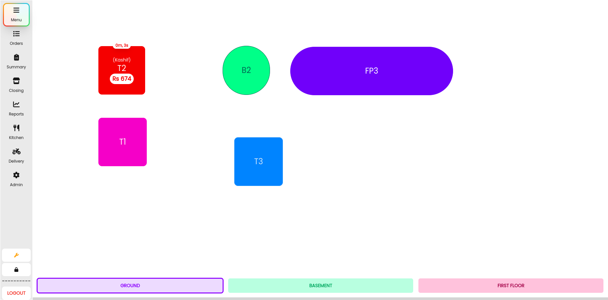
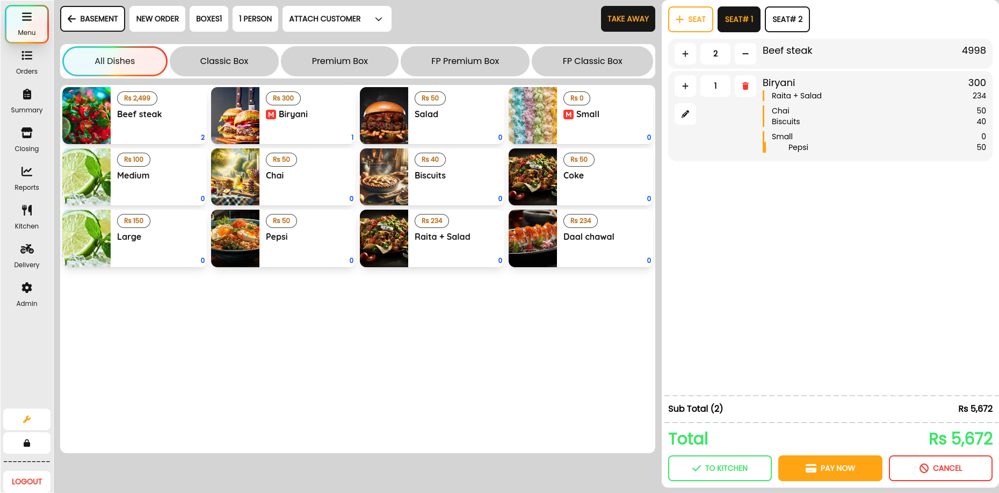
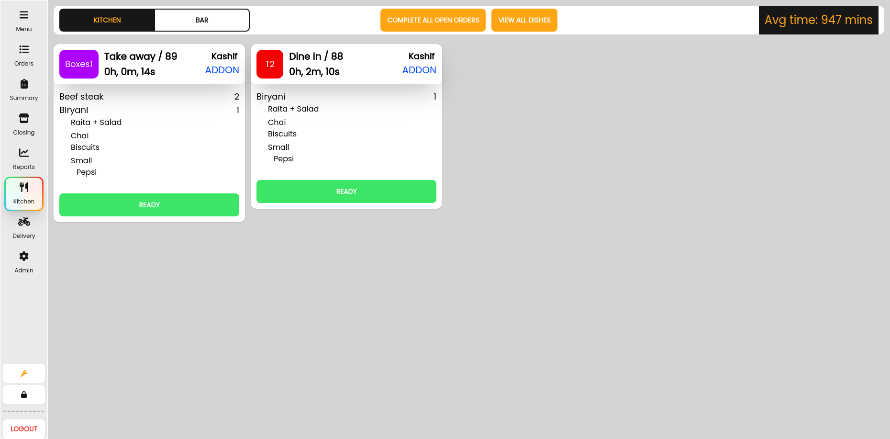
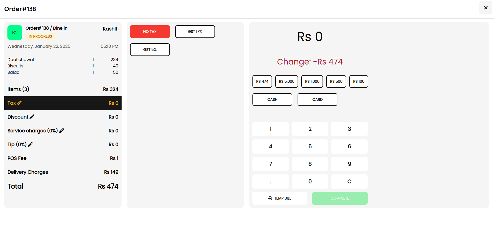
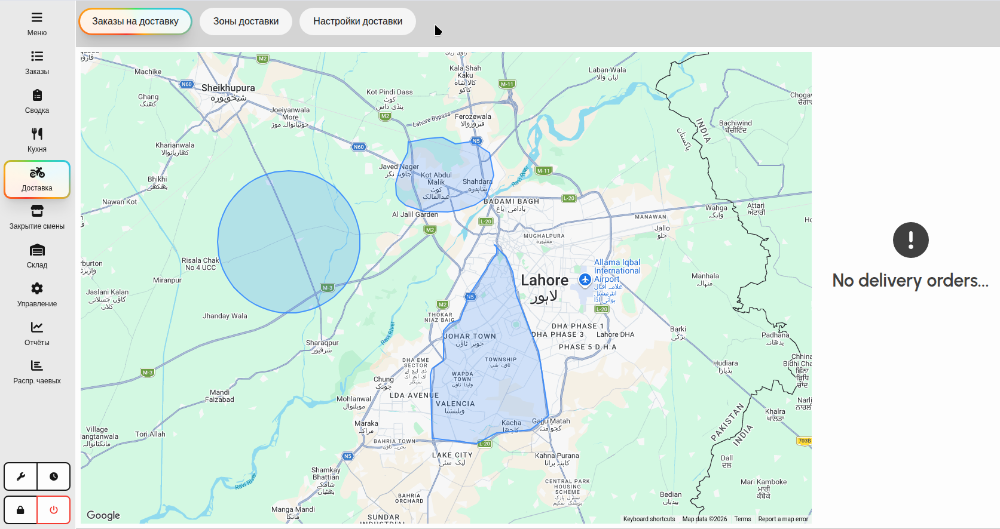

# 🍽️ Open Source Restaurant POS System (React + TypeScript + SurrealDB)
### ⚡ Fast • Modern • Touch Optimized • Multi-Lingual • Full Restaurant Operations Platform

A complete **restaurant management ecosystem** built for real-world cafés, restaurants, and food chains.
Offline-first POS that runs entirely on your local network — no internet required for day-to-day restaurant operations. Optional cloud sync enables multi-branch analytics and centralized management.
Designed to handle everything from **ordering → kitchen → delivery → staff → reporting → inventory** in one unified system.

---

## 🚀 Live Demo

👉 **Try it here:** [Demo](https://ahmedali5530.xyz/posr.html)  
🔑 Login: `1234, 0000, 5555 (super admin)`

---

## 💥 Why This Project?

Most restaurant systems are:
- ❌ Fragmented (POS, delivery, HR all separate)
- ❌ Not built for real-time restaurant pressure
- ❌ Weak staff workflow management
- ❌ Hard to scale across branches
- ❌ No proper authentication or protected modules

This system solves that by combining everything into one platform:

- ⚡ Real-time restaurant operations
- 🍽️ Full kitchen and order lifecycle
- 🍔 Advanced dish & modifiers management
- 🚚 Built-in delivery workflow
- 👨‍💼 Staff + manager + admin roles
- 🔐 Secure protected modules
- 📊 Full reporting and analytics layer
- 🏪 Multi-branch scalable system
- 🪑 Seat-based ordering and splitting
- 📑 Multi-order table management
- ☁️ Realtime Sync to cloud
- 💾 Automatic backups
- 💰 Automatic check closing and closing cycles
- 📋 Multiple menus support
- 💳 Third-party payment gateways support (Stripe, PayPal, M-Pesa, etc.)
- 🖨️ ESC/POS Printing Support (USB, Network, Serial, Bluetooth)
- 🌍 Multi-lingual interface support

---

## ✨ Core Modules

### 🍽️ POS & Order Management
- Table-based ordering system
- **Seat-Based Ordering & Splits:**
    - **Seat Assignments:** Assign specific dishes to individual seats for organized service.
    - **Split by Seat:** Easily split a large table's bill into separate orders based on seat assignments.
- **Multi-Order Table Management:**
    - **Concurrent Orders:** Support for multiple independent orders on the same table simultaneously.
    - **Visual Indicators:** Clear tracking of the number of active orders per table on the floor layout.
- **Takeaway Mode:**
    - **Quick Takeaway Orders:** Streamlined workflow for pickup and takeaway orders.
    - **Separate Queue Management:** Dedicated tracking for takeaway orders independent of dine-in tables.
    - **Customer Details:** Capture customer name, phone, and pickup time.
- Fast item selection & modifiers
- Split / merge / cancel / transfer orders / refunds
- **Split & Half-n-Half Payments:** Flexible payment options allowing customers to split bills or pay for half-n-half dish combinations.
- **Extras & Service Charges:**
    - **Automated Service Charges:** Apply percentage-based or fixed service charges to orders.
    - **Custom Extras:** Add additional charges for special requests, packaging, or premium services.
    - **Rule-based Application:** Automatically trigger extras based on order type, payment method, or specific tables.
- Real-time cart updates
- Instant billing flow

---

### 🍔 Dish Creation & Advanced Modifiers
- **Flexible Dish Management:** Create and organize dishes with custom pricing, tax rules, and multi-category assignments.
- **Excellent Modifiers Support:**
    - **Modifier Groups:** Group related options (e.g., "Sides", "Toppings", "Meat Temperature").
    - **Nested Modifiers:** Support for complex ordering flows where choosing a modifier opens another set of choices (e.g., Select "Combo" → Select "Side" → Select "Drink").
    - **Price Overrides:** Set specific prices for modifiers when they are part of a particular group or combination.
    - **Rules & Constraints:** Define minimum and maximum selections per group.
- **Visual Menu Builder:** Intuitive interface for designing the customer-facing menu.

---

### 👨‍🍳 Kitchen Display System (KDS)
- Live incoming orders
- **Multi-Stage Kitchen Workflows:**
    - **Customizable Preparation Stages:** Create custom kitchen stages for complex workflows (e.g., Prep Station → Grill → Assembly → Expo).
    - **Station-Based Routing:** Automatically route specific dishes to designated kitchen stations.
    - **Stage-to-Stage Handoff:** Track order progression through each preparation stage with visual status updates.
    - **Parallel Processing:** Multiple stations can work on different components of the same order simultaneously.
- Status tracking:
    - Received
    - Preparing
    - Ready
    - Served
- Reduced communication delays between staff & kitchen
- Recall orders

---

### 🚚 Delivery Management App
- Custom built delivery apps with multiple menu support
- Realtime updates to customer
- Delivery order assignment
- Driver status tracking
- Order dispatch flow
- Delivery completion updates
- Separate delivery workflow from dine-in
- **Smart Coupons & Discounts:**
    - **Flexible Discount Types:** Support for fixed amount, percentage-based, and free shipping coupons.
    - **Usage Constraints:** Set minimum order amounts, maximum discount caps, and usage limits per user.
    - **Time-Based Validity:** Schedule coupons for specific dates, times, or days of the week.
    - **Targeted Rules:** First-order only coupons and stackability controls.
- Uses Google maps to display orders and updates

---

### 📱 Order Taking App (Waiter App)
- Mobile-first order entry
- Table selection & quick ordering
- Instant sync with kitchen
- Lightweight POS mode for staff devices
- Full touch compatible modules for faster order processing

---

### 👨‍💼 Manager App (Admin Control Center)
- Real-time business dashboard
- Sales & performance analytics
- Staff performance tracking
- Branch-level reporting
- System configuration

---

### 💰 Automatic Checks & Closing Cycles
- **Automatic Check Closing:** Configure system to automatically close open checks after a specific idle time or at end-of-day.
- **Closing Cycle Enforcement:** Prevent new orders when a closing cycle is required.
- **Shift & Day Closing:** Streamlined workflow for ending staff shifts and daily business cycles.
- **Real-time enforcement:** Instant notifications when cycles need to be closed.

---

### 📋 Multiple Menus Support
- **Custom Menu Creation:** Create different menus for different times (e.g., Breakfast, Lunch, Dinner).
- **Dynamic Pricing:** Set different prices for items across different menus.
- **Delivery App Integration:** Link specific menus to delivery app.

---

### 💳 Third-Party Payment Gateways
- **Integrated Payments:** Support for popular payment gateways.
- **Multi-Provider Support:**
    - 💳 **Stripe** (Credit/Debit Cards)
    - 🅿️ **PayPal**
    - 📱 **JazzCash / M-Pesa / Telebirr** (Mobile Payments)
- **Secure Processing:** PCI-compliant flows with sandbox/live mode support.
- **Instant Settlement:** Real-time payment verification and order status updates.

---

### 🖨️ ESC/POS Printing Support
- **Multi-Interface Support:** Print to thermal printers via **USB**, **Serial**, **Network (TCP/IP)**, or **Bluetooth**.
- **Specialized Print Builders:**
    - 🍳 **Kitchen Tickets:** Clear, priority-coded slips for kitchen staff.
    - 🧾 **Customer Receipts:** Professional final bills with payment details and change.
    - 🚚 **Delivery Slips:** Includes customer address, phone, and delivery notes.
    - 📑 **Pre-sale Bills:** Temporary slips for table service before final payment.
    - 📊 **Sales Summaries:** Comprehensive end-of-day/shift, P-Mix, Server Sales reports directly from the printer.
- **Branding & Customization:**
    - Support for **custom logos** (Base64) and company branding.
    - Configurable **VAT/Tax details** and headers/footers.
    - Adjustable margins and item display preferences.
- **Reliable Architecture:** Independent Node.js print server ensures printing doesn't block the main POS application.

---

### 🧑‍💼 Staff Management & Shifts
- Shift creation & scheduling
- Clock-in / clock-out tracking
- Work hour monitoring
- Staff assignment per branch

---

### 🔐 Protected Modules & Role System
- Role-based access control:
    - Admin
    - Manager
    - Waiter
    - Kitchen Staff
    - Delivery Staff
    - ... and Custom roles
- Protected routes & permissions per module accross web and mobile platforms
- Secure operational separation

---

### 💰 Tips Distribution System
- Track collected tips
- Automatic tip pooling
- Staff-based distribution rules
- Shift-based tip allocation

---

### ⏱️ Time Tracking System
- Employee working hours tracking
- Shift duration monitoring
- Late/early detection
- Attendance history logs

---

### 📦 Inventory Integration
- **Stock-Aware Menu System:** Real-time visibility of ingredient availability.
- **Recipe-Based Deduction:** Automatically deduct stock based on dish recipes when orders are placed.
- **Comprehensive Stock Management:**
    - **Purchase Orders & Returns:** Manage supplier orders and incoming inventory.
    - **Internal Issues & Returns:** Track stock movement between stores or kitchen departments.
    - **Waste Tracking:** Log and analyze food waste to optimize costs.
- **Multi-Store Support:** Manage inventory across different storage locations or branches.
- **Low Stock Alerts:** Automated notifications when items fall below safety levels.
- **Supplier Management:** Maintain a database of suppliers and their performance.

---

### 🌍 Multi-Lingual Support
- **10 Supported Languages:**
    - 🇬🇧 **English**
    - 🇪🇸 **Español** (Spanish)
    - 🇹🇷 **Türkçe** (Turkish)
    - 🇧🇷 **Português** (Brazilian Portuguese)
    - 🇫🇷 **Français** (French)
    - 🇳🇱 **Nederlands** (Dutch)
    - 🇩🇪 **Deutsch** (German)
    - 🇮🇹 **Italiano** (Italian)
    - 🇸🇦 **العربية** (Arabic)
    - 🇷🇺 **Русский** (Russian)
- **RTL Support:** Full right-to-left text direction support for Arabic and other RTL languages.
- **Dynamic Language Switching:** Users can switch languages on-the-fly without reloading.
- **Localized Interface:** All UI elements, menus, and system messages are fully translated.

---

## ⚡ Speed-Focused UX

Built for real restaurant pressure situations:
- Minimal clicks ordering
- Touch-screen-friendly workflow
- Quick table switching
- Optimized for peak-hour usage

---

## 🏗️ Tech Stack

- ⚛️ React.js (Frontend)
- 🗄 IndexedDB
- 🗄️ SurrealDB
- 🌐  Websockets Architecture
- 🗄️ Realtime Database-driven inventory & orders

---

## 📸 Screenshots







---

## 🔥 Key Highlights

- Built specifically for **restaurant workflows**
- Handles **real-time order lifecycle**
- Designed for **high-pressure environments**
- Supports **multi-table restaurant operations**
- Scalable for **small cafés → multi-branch restaurants**
- **Delivery apps**
- **Order taking apps**
- Manager apps for **authentication and reporting**
---

## ⚡ Quick Start with Docker

```bash
git clone https://github.com/ahmedali5530/restaurant-pos
cd restaurant-pos
bun install
docker compose up -d
```
---

## 🧭 Roadmap and WIP
- Advanced analytics dashboard
- AI-based reporting and demand forecasting
- Multi-branch synchronization improvements
- Payroll system integration
- Account module integration
- OR Code and Self ordering system
- Tap-to-pay payments on mobile apps
- Targeted sales system for performance
- Multi-currency support
- Advanced inventory operations and analytics
- Loyalty module

---

## 🤝 Contributing

Want to improve this system?

Fork the repo 🍴
Create a feature branch 🌿
Submit a PR 🚀

---

## ⭐ Support

If this project helps you, please consider giving it a ⭐ on GitHub.

It helps increase visibility and motivates continued development.